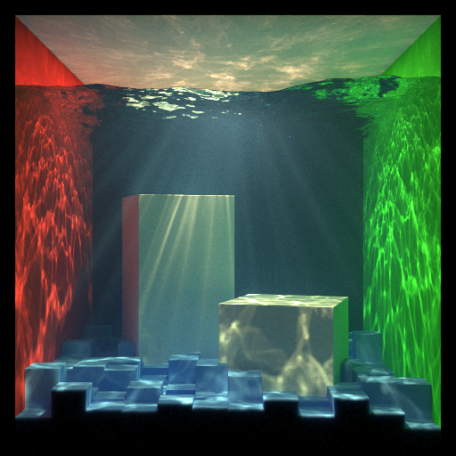

# volppm



Volumetric progressive photon mapping written in C++.

WIP.

## Features

* Homogeneous medium
* [Hero wavelength sampling](https://doi.org/10.1145/3306346.3323025) for chromatic absorption/scattering coefficient
* [Artist friendly parameter](https://doi.org/10.1145/2897839.2927433) to control absorption/scattering coefficient
* Random walk subsurface scattering
* Load obj model

## Requirements

* C++ (20>=)
* CMake (3.20>=)
* OpenMP
* [spdlog](https://github.com/gabime/spdlog)
* [Embree](https://github.com/embree/embree) (>=3)

## Build

|CMake option|Description|
|:--|:--|
|BUILD_TESTS|build tests|

```
git submodule update --init
mkdir build
cd build
cmake -DCMAKE_BUILD_TYPE=Release ..
make
```

## Gallery

### Water cornell box

|Parameter|Value|
|:--|:--|
|number of iterations|1000|
|number of photons in each iteration|200000|
|alpha|3/4|
|initial search radius for surface|0.01|
|initial search radius for volume|0.05|


This model is available at `models/CornellBox-Water-Small-Light-Covered-Cube-Floor-No-Backwall.obj`

## References

* [Physically Based Rendering:From Theory To Implementation, Matt Pharr, Wenzel Jakob, and Greg Humphreys](https://pbr-book.org/)
* [Efficient simulation of light transport in scenes with participating media using photon maps](https://doi.org/10.1145/280814.280925)
* [Hachisuka, Toshiya, Shinji Ogaki, and Henrik Wann Jensen. "Progressive photon mapping." ACM SIGGRAPH Asia 2008 papers. 2008. 1-8.](https://doi.org/10.1145/1457515.1409083)
* [Hachisuka, Toshiya, and Henrik Wann Jensen. "Stochastic progressive photon mapping." ACM SIGGRAPH Asia 2009 papers. 2009. 1-8.](https://doi.org/10.1145/1661412.1618487)
* [Knaus, Claude, and Matthias Zwicker. "Progressive photon mapping: A probabilistic approach." ACM Transactions on Graphics (TOG) 30.3 (2011): 1-13.](https://doi.org/10.1145/1966394.1966404)
* [Wilkie, Alexander, et al. "Hero wavelength spectral sampling." Computer Graphics Forum. Vol. 33. No. 4. 2014.](https://doi.org/10.1111/cgf.12419)
* [Chiang, Matt Jen-Yuan, Peter Kutz, and Brent Burley. "Practical and controllable subsurface scattering for production path tracing." ACM SIGGRAPH 2016 Talks (2016): 1-2.](https://doi.org/10.1145/2897839.2927433)
* [Fong, Julian, et al. "Production volume rendering: Siggraph 2017 course." ACM SIGGRAPH 2017 Courses. 2017. 1-79.](https://doi.org/10.1145/3084873.3084907)
* [Wrenninge, Magnus, Ryusuke Villemin, and Christophe Hery. Path traced subsurface scattering using anisotropic phase functions and non-exponential free flights. Tech. Rep. 17-07, Pixar. https://graphics. pixar. com/library/PathTracedSubsurface, 2017.](https://graphics.pixar.com/library/PathTracedSubsurface/paper.pdf)
* [Novák, Jan, et al. "Monte Carlo methods for volumetric light transport simulation." Computer Graphics Forum. Vol. 37. No. 2. 2018.](https://doi.org/10.1111/cgf.13383)